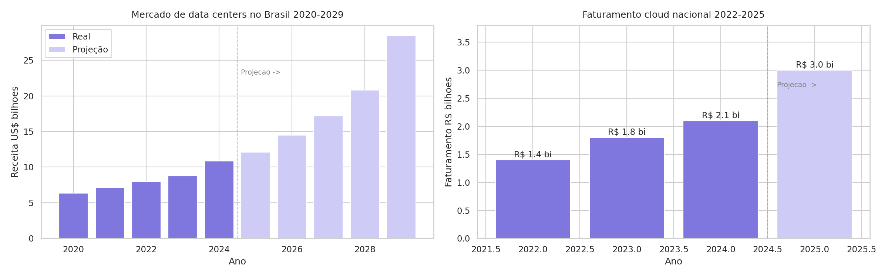

# Análise de Data Centers e Cloud no Brasil 🇧🇷

Análise exploratória do mercado de infraestrutura digital brasileiro,
mapeando investimentos, crescimento de receita e projeções até 2029.

## Objetivo
Entender para onde estão indo os bilhões investidos em Data Centers
e Cloud no Brasil, e qual o tamanho real desse mercado.

## Principais insights
- 🏦 R$ 30 bilhões em investimentos anunciados em 2024/2025
- 🤖 82% do capital vai para Cloud + IA (Microsoft e Amazon lideram)
- 📈 Mercado cresceu 71% entre 2020 e 2024
- 🚀 Projeção de crescimento de 162% até 2029
- 🌎 Brasil representa 50% dos investimentos da América Latina no setor

## Visualizações

## Ferramentas
Python · pandas · matplotlib · seaborn

## Fontes
- Brasscom (2024)
- Moody's Local Brasil (2025)
- AbraCloud Panorama 2025
- Mordor Intelligence

## Sobre
Primeiro projeto de análise de dados desenvolvido de forma independente,
sem dataset pronto — dataset construído manualmente a partir de
relatórios públicos oficiais.
